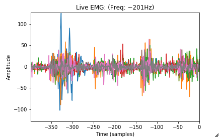

# Live EMG from a Myo Armband

Simple demo of streaming EMG data from a Myo to a Jupyter notebook. Utilises [myo-python](https://github.com/NiklasRosenstein/myo-python).

## Theory
Uses a seperate thread to keep a queue of EMG data and exposes that structure or allows extraction of data since last call.

## Setup
In addition to [Jupyter](https://jupyter.org) you'll need:
* myo-python: `pip install myo-python` + other dependencies in notebook
* [Myo Connect](https://developer.thalmic.com/downloads)
* [Myo SDK](https://developer.thalmic.com/downloads)
    * Ensure `bin` folder of SDK is on your path
* Connect a Myo via Myo Connect and you're ready

